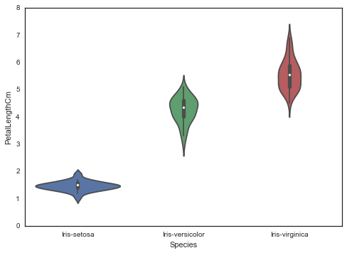
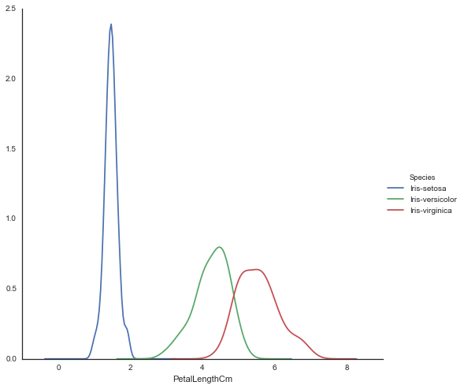

# 利用pandas matplotlib seaborn对Iris数据集进行可视化分析

https://www.kaggle.com/benhamner/d/uciml/iris/python-data-visualizations


```python
#-*- coding:utf-8 -*-
%matplotlib inline
import pandas as pd
import warnings #忽略seaborn产生的警告信息
warnings.filterwarnings("ignore")
import seaborn as sns
import matplotlib.pyplot as plt

```


```python
sns.set(style="white", color_codes=True)

#读入Iris数据
iris = pd.read_csv('Iris.csv')


```


先查看数据的大体情况


```python

iris.head()
```


<div>
<table border="1" class="dataframe">
  <thead>
    <tr style="text-align: right;">
      <th></th>
      <th>Id</th>
      <th>SepalLengthCm</th>
      <th>SepalWidthCm</th>
      <th>PetalLengthCm</th>
      <th>PetalWidthCm</th>
      <th>Species</th>
    </tr>
  </thead>
  <tbody>
    <tr>
      <th>0</th>
      <td>1</td>
      <td>5.1</td>
      <td>3.5</td>
      <td>1.4</td>
      <td>0.2</td>
      <td>Iris-setosa</td>
    </tr>
    <tr>
      <th>1</th>
      <td>2</td>
      <td>4.9</td>
      <td>3.0</td>
      <td>1.4</td>
      <td>0.2</td>
      <td>Iris-setosa</td>
    </tr>
    <tr>
      <th>2</th>
      <td>3</td>
      <td>4.7</td>
      <td>3.2</td>
      <td>1.3</td>
      <td>0.2</td>
      <td>Iris-setosa</td>
    </tr>
    <tr>
      <th>3</th>
      <td>4</td>
      <td>4.6</td>
      <td>3.1</td>
      <td>1.5</td>
      <td>0.2</td>
      <td>Iris-setosa</td>
    </tr>
    <tr>
      <th>4</th>
      <td>5</td>
      <td>5.0</td>
      <td>3.6</td>
      <td>1.4</td>
      <td>0.2</td>
      <td>Iris-setosa</td>
    </tr>
  </tbody>
</table>
</div>


```python
iris.info()
```

    <class 'pandas.core.frame.DataFrame'>
    Int64Index: 150 entries, 0 to 149
    Data columns (total 6 columns):
    Id               150 non-null int64
    SepalLengthCm    150 non-null float64
    SepalWidthCm     150 non-null float64
    PetalLengthCm    150 non-null float64
    PetalWidthCm     150 non-null float64
    Species          150 non-null object
    dtypes: float64(4), int64(1), object(1)
    memory usage: 7.6+ KB
    

可以发现数据集 共有150个样本，每个样本有六列.


再看看数据集的统计特性


```python
iris.describe()
```


<div>
<table border="1" class="dataframe">
  <thead>
    <tr style="text-align: right;">
      <th></th>
      <th>Id</th>
      <th>SepalLengthCm</th>
      <th>SepalWidthCm</th>
      <th>PetalLengthCm</th>
      <th>PetalWidthCm</th>
    </tr>
  </thead>
  <tbody>
    <tr>
      <th>count</th>
      <td>150.000000</td>
      <td>150.000000</td>
      <td>150.000000</td>
      <td>150.000000</td>
      <td>150.000000</td>
    </tr>
    <tr>
      <th>mean</th>
      <td>75.500000</td>
      <td>5.843333</td>
      <td>3.054000</td>
      <td>3.758667</td>
      <td>1.198667</td>
    </tr>
    <tr>
      <th>std</th>
      <td>43.445368</td>
      <td>0.828066</td>
      <td>0.433594</td>
      <td>1.764420</td>
      <td>0.763161</td>
    </tr>
    <tr>
      <th>min</th>
      <td>1.000000</td>
      <td>4.300000</td>
      <td>2.000000</td>
      <td>1.000000</td>
      <td>0.100000</td>
    </tr>
    <tr>
      <th>25%</th>
      <td>38.250000</td>
      <td>5.100000</td>
      <td>2.800000</td>
      <td>1.600000</td>
      <td>0.300000</td>
    </tr>
    <tr>
      <th>50%</th>
      <td>75.500000</td>
      <td>5.800000</td>
      <td>3.000000</td>
      <td>4.350000</td>
      <td>1.300000</td>
    </tr>
    <tr>
      <th>75%</th>
      <td>112.750000</td>
      <td>6.400000</td>
      <td>3.300000</td>
      <td>5.100000</td>
      <td>1.800000</td>
    </tr>
    <tr>
      <th>max</th>
      <td>150.000000</td>
      <td>7.900000</td>
      <td>4.400000</td>
      <td>6.900000</td>
      <td>2.500000</td>
    </tr>
  </tbody>
</table>
</div>


```python

```

这个数据集是三分类问题，我们可以看看每个类别有多少样本,


```python
iris["Species"].value_counts()
```


    Iris-setosa        50
    Iris-versicolor    50
    Iris-virginica     50
    Name: Species, dtype: int64


发现类别均衡


```python

```

## 画图

然后开始可视化分析


```python


```


```python

```

我们可以直接用DataFrame结构中的plot画图，
先画出 特征之间的散点图.


```python


```


```python

iris.plot(kind="scatter", x="SepalLengthCm", y="SepalWidthCm")

```


    <matplotlib.axes._subplots.AxesSubplot at 0x15286e30>


```python

```


```python

```

再利用seaborn 画其他类型的图，jointplot能够同时显示二特征的散点图和每个特征各自的直方图


```python
sns.jointplot(x="SepalLengthCm",y="SepalWidthCm",data=iris,size=10)
```


    <seaborn.axisgrid.JointGrid at 0x182dab10>


```python

```


```python

```

上面两幅散点图还缺少一个重要信息：没有显示每个点的类属性

我们可以用seaborn的FaceGrid去给每个类别标注不同的颜色


```python

sns.FacetGrid(iris, hue="Species",size=8)\
    .map(plt.scatter, "SepalLengthCm", "SepalWidthCm")\
    .add_legend()
```


    <seaborn.axisgrid.FacetGrid at 0x184d3710>


我们也可用 boxplot看每个特征在各个类别下的分布情况


```python
sns.boxplot(x="Species",y="PetalLengthCm",data=iris)
```


    <matplotlib.axes._subplots.AxesSubplot at 0x185fba70>


从上图不难发现，那些类别术语iris-setosa的样本 他们的PetalLengthCm数据范围基本在[1,2],并且集中在1.5左右


```python

```


```python

```

再来看看violinplot

数据密集的区域在图中很胖，稀疏的区域就很瘦,


```python

sns.violinplot(x="Species",y="PetalLengthCm",data=iris,size=6)
```


    <matplotlib.axes._subplots.AxesSubplot at 0x1869bab0>





```python

```


```python

```

kdeplot对于观察每个特征数据情况也很有用，
which creates and visualizes a kernel density estimates of the underlying feature


```python
sns.FacetGrid(iris, hue="Species",size=7)\
    .map(sns.kdeplot,"PetalLengthCm")\
    .add_legend()
```


    <seaborn.axisgrid.FacetGrid at 0x188caa50>





```python

```


```python

```


```python

```

特征之间往往是相互联系的，pairplot能够观察两个特征之间的联系
注意要去掉Id这一维度


```python
sns.pairplot(iris.drop("Id",axis=1),hue="Species",size=3)


```


    <seaborn.axisgrid.PairGrid at 0x1b06f3f0>


对角线显示的是每个特征的信息，可以其他类型图替换，比如我们可以用kdeplto替换直方图


```python
sns.pairplot(iris.drop("Id", axis=1), hue="Species", size=3, diag_kind="kde")
```


    <seaborn.axisgrid.PairGrid at 0x1e804950>


```python

```

上面基本覆盖了seaborn常用到的图类型

我们再来看下pandas的画图功能，


我们可以对每一个特征画不同类别下的boxplot


```python
iris.drop("Id",axis=1).boxplot(by="Species", figsize=(12,6))
```


    array([[<matplotlib.axes._subplots.AxesSubplot object at 0x1FDA3970>,
            <matplotlib.axes._subplots.AxesSubplot object at 0x1FE23850>],
           [<matplotlib.axes._subplots.AxesSubplot object at 0x1FEAF130>,
            <matplotlib.axes._subplots.AxesSubplot object at 0x1FED7F30>]], dtype=object)


```python


```


```python

```


```python

```

Andrews Curves： are a method for visualizing multidimensional data by mapping each observation onto a function

Andrews Curves involve using attributes of samples as coefficients for Fourier series and then plotting these


```python
from pandas.tools.plotting import andrews_curves
andrews_curves(iris.drop("Id", axis=1), "Species")
```


    <matplotlib.axes._subplots.AxesSubplot at 0x202dc1d0>


```python

```


```python
# Another multivariate visualization technique pandas has is parallel_coordinates
# Parallel coordinates plots each feature on a separate column & then draws lines
# connecting the features for each data sample
from pandas.tools.plotting import parallel_coordinates
parallel_coordinates(iris.drop("Id", axis=1), "Species")
```


    <matplotlib.axes._subplots.AxesSubplot at 0x206c45b0>


```python

```


```python
# A final multivariate visualization technique pandas has is radviz
# Which puts each feature as a point on a 2D plane, and then simulates
# having each sample attached to those points through a spring weighted
# by the relative value for that feature
from pandas.tools.plotting import radviz
radviz(iris.drop("Id", axis=1), "Species")
```


    <matplotlib.axes._subplots.AxesSubplot at 0x20b855b0>


```python

```
